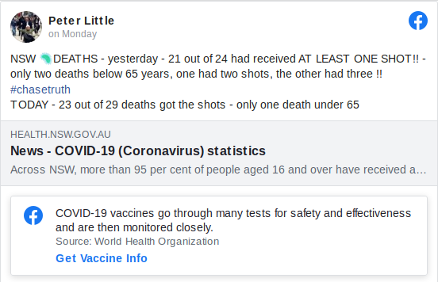

```{r setup, include=FALSE, echo=FALSE, message=FALSE, warning=FALSE}
knitr::opts_chunk$set(echo = TRUE)
require(ggplot2)
require(lubridate)
```

## Plots

TODO: Add plots here

## COVID-19 Hospitalizations

COVID-19 hospitalization data is openly reported but the information provided is
being misrepresented. Take for example the following
[Facebook post](https://www.facebook.com/plugins/post.php?href=https%3A%2F%2Fwww.facebook.com%2Fgraeme.little.9849%2Fposts%2F2156196067868725):



While accurate with regards to the numbers, Little is implying that vaccination
does not work as more people are in hospital who have been vaccinated than those
that have not. This is a dis-representation because the empathizes Little makes
is on the _absolute number_ rather than the rate of the vaccinated vs
un-vaccinated.

As an example let's use some data roughly in accordance with the figures
available from the same source as Little's, namely NSW health.

```{r nsw-hospitalisations}
tot_pop <- 1000
vax_pop <- 0.929 * tot_pop
unvax_pop <- (1 - 0.929) * tot_pop

vax_hos <- sum (2627, 215)
unvax_hos <- sum (315, 55)

vax_death <- 67
unvax_death <- 21
```

Rate of un-vaccinated in hospital is:

```{r unvax}
unvax_rate <- unvax_hos / unvax_pop
unvax_rate
```

Rate of vaccinated in hospital is:

```{r vax}
vax_rate <- vax_hos / vax_pop
vax_rate
```

## References

* [The Guardian: The simple numbers every government should use to fight anti-vaccine misinformation](https://www.theguardian.com/news/datablog/ng-interactive/2022/jan/28/the-simple-numbers-every-government-should-use-to-fight-anti-vaccine-misinformation)
* [OurWorldInData: How do death rates from COVID-19 differ between people who are vaccinated and those who are not?](https://ourworldindata.org/covid-deaths-by-vaccination)
* [COVID-19 WEEKLY SURVEILLANCE IN NSW, EPIDEMIOLOGICAL WEEK 01 ENDING 8 JANUARY 2022, Published 20 January 2022](https://www.health.nsw.gov.au/Infectious/covid-19/Documents/covid-19-surveillance-report-20220120.pdf)
* [NSW Vaccination Status](https://www.health.gov.au/sites/default/files/documents/2022/01/covid-19-vaccine-rollout-update-23-january-2022.pdf)
*
  [COVID-19 WEEKLY SURVEILLANCE IN NSW, EPIDEMIOLOGICAL WEEK 01 ENDING 8 JANUARY 2022, Published 20 January 2022](https://www.health.nsw.gov.au/Infectious/covid-19/Documents/covid-19-surveillance-report-20220120.pdf)
  In this report, table 5 shows Hospitalisations, ICU admissions and deaths
  among cases diagnosed with COVID-19, by vaccination status, NSW, from 26
  November 2021 to 8 January 2022.